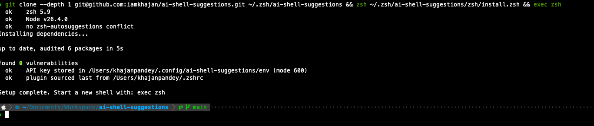

# ai-shell-suggestions




## What it is 
Usecase around System One/Decission model - Important it doesnt generate so no direct compare to LLM
- Gives command auto suggestion with highest score
- Domain understanding
- ag - grep
- ah - history commands

## Install

Try it with one command:

```sh
git clone --depth 1 git@github.com:iamkhajan/ai-shell-suggestions.git ~/.zsh/ai-shell-suggestions && zsh ~/.zsh/ai-shell-suggestions/zsh/install.zsh && exec zsh
```

Setup prompts for `TYPESAFE_API_KEY` and stores it outside `~/.zshrc` with
owner-only permissions.

To check an existing setup without changing it:

```sh
❯ npm run doctor

> ai-shell-suggestions@0.1.0 doctor
> zsh zsh/install.zsh --check

  ok    zsh 5.9.1
  ok    Node v26.5.0
  ok    no zsh-autosuggestions conflict
  ok    API key available from /Users/iamkhajan/.config/ai-shell-suggestions/env
  ok    plugin sourced last from /Users/iamkhajan/.zshrc
```

### zsh-autosuggestions conflict

`ai-shell-suggestions` attempts to replace or alternate to `zsh-autosuggestions`

Setup detects active references and tells you which lines to change. Drop it
from your plugin list, then rerun setup:

```diff
-plugins=(git zsh-autosuggestions zsh-syntax-highlighting)
+plugins=(git zsh-syntax-highlighting)
```

The installer then ensures `ai-shell-suggestions` is sourced last, after frameworks
and other widget-wrapping plugins.

## Priority commands

Point `JEV_PRIORITY_FILE` at a plain text file with one command per line.
A `# heading` assigns its text as the group for the commands below it:

```zsh
export JEV_PRIORITY_FILE=~/.commands.txt
```

```
# git
git checkout -b feature/
git add -A && git commit -m ""

# docker
docker compose up -d
```

## History search

`ah` finds a command by meaning in the 500 most recent distinct history entries.
It searches bounded batches and reranks their best candidates:

```zsh
ah "how was payment service deployed"
ah "show worktree for account"
```

Run `node src/ah-cli.ts --help` for configurable history, result, and confidence
limits.
